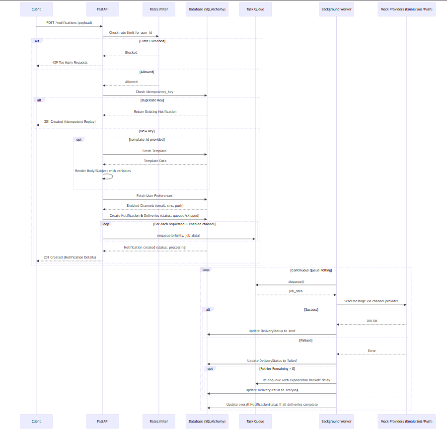
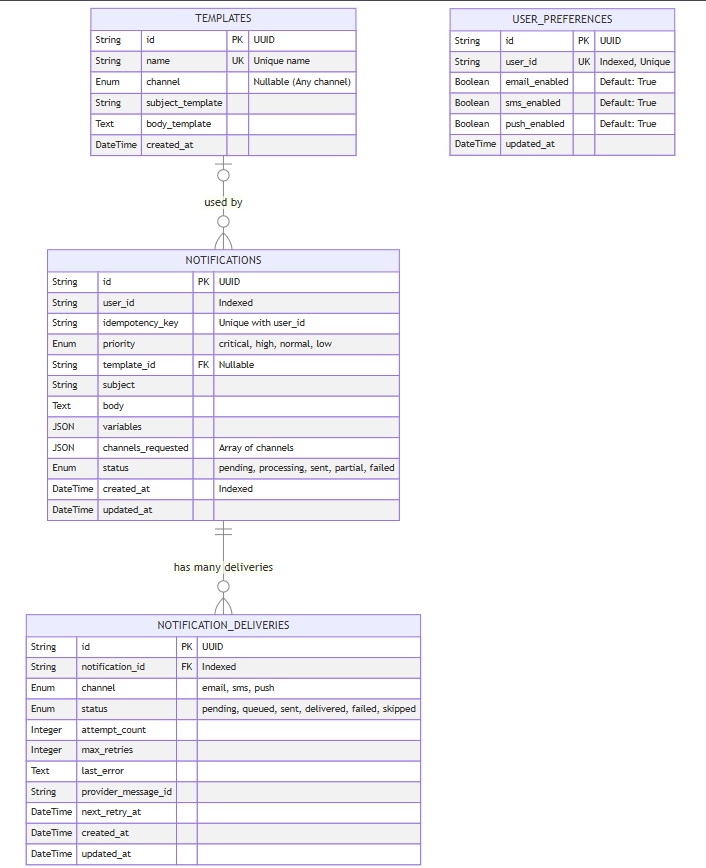
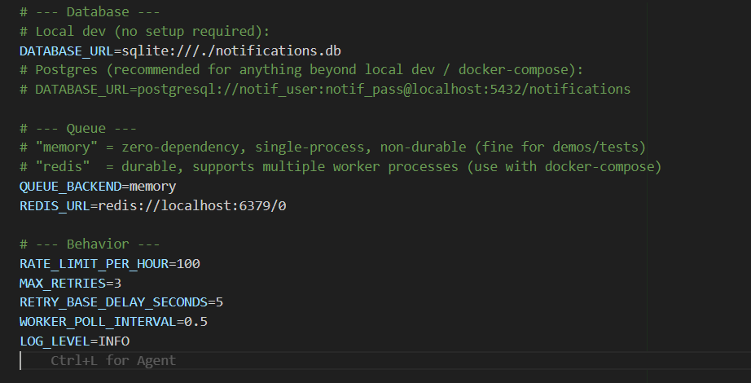

# DESIGN.md — Notification Service

## High-level architecture

The API and the worker are **separate processes** that only communicate
through the database and the queue — never directly. This is the core
design decision: it means the API can return a response in milliseconds
(just "I've accepted and queued this") while the actual, possibly-slow,
possibly-flaky work of calling a provider happens asynchronously and can be
scaled independently (more workers, not more API instances, if delivery is
the bottleneck).

## Database schema

**Why split `notifications` from `notification_deliveries` instead of one
table?** A single request can fan out to 3 channels, each with its own
independent success/failure/retry history. Modeling that as one row per
*channel attempt*, with a parent row per *request*, means:
- Querying "what's the status of channel X for this notification" is a
  simple indexed lookup, not unpacking a JSON blob.
- Each channel retries independently — email failing doesn't block or
  conflate with SMS succeeding.
- The parent's overall `status` is a derived rollup (`sent` if all
  non-skipped deliveries succeeded, `partial` if some failed, etc.), computed
  by the worker after each delivery update.

**Why `UNIQUE(user_id, idempotency_key)` instead of a global unique
constraint on just `idempotency_key`?** Idempotency keys are caller-supplied
strings (e.g. `"order-456-shipped"`); scoping the uniqueness per-user avoids
forcing every caller in the whole system to coordinate on a single global
namespace of keys.

## How failures and retries are handled

1. A delivery job is dequeued by a worker and handed to the relevant mock
   provider.
2. On failure, `attempt_count` is incremented and compared to `max_retries`
   (default 3, configurable).
   - **Under the limit:** the job is re-enqueued onto a *delayed* queue with
     `run_at = now + base_delay * 2^(attempt-1)` — i.e. exponential backoff
     (5s, 10s, 20s by default). The worker's main loop calls
     `move_ready_retries()` on every iteration, which moves anything whose
     `run_at` has passed back into the appropriate priority queue.
   - **At the limit:** the delivery is marked `failed` permanently and the
     error is preserved in `last_error` for debugging/observability.
3. The parent notification's `status` is recomputed after every delivery
   update, so `GET /notifications/:id` always reflects the latest rollup
   without the client needing to poll each channel separately.
4. **No notification is ever lost on a crash**, because the queue item isn't
   removed until the worker successfully processes it (Redis `LPOP` is
   atomic; if the worker process dies mid-processing before committing the
   DB update, the *delivery row* still shows its last known status, and an
   operator can detect "stuck" deliveries via a stale `updated_at` + status
   still `queued`. A production hardening would add a dead-letter queue and
   a watchdog for this case — see "Trade-offs" below.

## How the system would scale

- **API tier**: stateless — `uvicorn` workers behind a load balancer scale
  horizontally with zero coordination needed, since all state lives in
  Postgres/Redis, not in-process.
- **Queue tier**: Redis lists handle very high throughput for simple
  push/pop; at the 1000+ notifications/second target, the more likely
  bottleneck is Postgres write throughput, not Redis. For higher scale than
  a single Redis instance can handle, this would migrate to a partitioned
  message broker (Kafka/SQS) with one topic per channel, as most of the
  system-design literature on this problem converges on.
- **Worker tier**: this is the easiest tier to scale — just run more worker
  processes/containers pointed at the same Redis instance. Since priority
  queues are separate Redis lists, you can also run *dedicated* worker pools
  per priority (e.g. more workers draining `critical` than `low`) without
  any code change.
- **Database tier**: `notification_deliveries` is the highest-write table and
  is indexed on `(status, channel)` for the worker's "what needs retrying"
  queries and on `(user_id, created_at)` on the parent table for the history
  endpoint. At very large scale this table would be partitioned by time
  (e.g. monthly) since notification history is naturally append-heavy and
  time-ordered.
- **Idempotency & rate limiting** are already implemented in a way that's
  safe across multiple API instances: idempotency relies on a DB unique
  constraint (race-safe even with concurrent requests), and the Redis-backed
  rate limiter (used automatically when `QUEUE_BACKEND=redis`) shares state
  across every API process rather than per-instance memory.

## Trade-offs made, and why

| Decision | Trade-off | Why it's acceptable here |
|---|---|---|
| Fixed-window rate limiting (not sliding/token-bucket) | Allows a burst of up to 2x the limit right at a window boundary | Much simpler to implement and reason about; the assignment's "max X/hour" framing doesn't demand strict smoothness, and this is a documented, easy follow-up (swap in a Redis sorted-set sliding window) rather than a hidden gap. |
| In-memory queue/rate-limiter as the *default* | Not durable, single-process only | Means `git clone && pip install && run` works with zero infrastructure for a reviewer, while `docker-compose up` demonstrates the durable, multi-process Redis path — best of both for a take-home assignment. |
| Polling worker loop (not Redis `BLPOP` blocking pop) | Slightly less efficient than blocking reads; adds up to `WORKER_POLL_INTERVAL` (0.5s) latency when idle | Keeps the in-memory and Redis backends behind the *exact same* interface (`dequeue()` returns `None` rather than blocking), which was worth more than the latency cost for a demo of this scope. A production version would use blocking pops or a pub/sub wakeup. |
| No webhook support / circuit breaker / k8s manifests (bonus items) | Those bonus features aren't implemented | Given the 4–6 hour estimate, time was spent making the *required* features (retry, idempotency, rate limiting, priority, preferences) solid and well-tested rather than partially implementing every bonus. Webhooks and a circuit breaker are natural next additions; the queue/provider abstractions are already shaped to make both easy to slot in later. |
| Status rollup computed eagerly after each delivery update | Slightly more DB writes than computing it lazily on read | Makes `GET /notifications/:id` a single cheap read with no aggregation query, which matters more given that endpoint is likely read far more often than deliveries are written. |

## Use .env 

