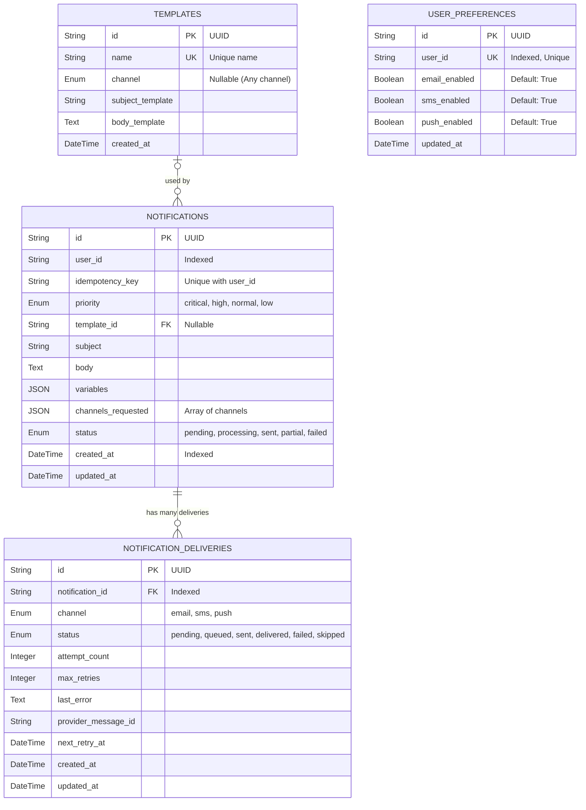

# Notification Service: Database Schema

```mermaid
erDiagram
    NOTIFICATIONS ||--o{ NOTIFICATION_DELIVERIES : "has many deliveries"
    TEMPLATES |o--o{ NOTIFICATIONS : "used by"
    
    NOTIFICATIONS {
        String id PK "UUID"
        String user_id "Indexed"
        String idempotency_key "Unique with user_id"
        Enum priority "critical, high, normal, low"
        String template_id FK "Nullable"
        String subject
        Text body
        JSON variables
        JSON channels_requested "Array of channels"
        Enum status "pending, processing, sent, partial, failed"
        DateTime created_at "Indexed"
        DateTime updated_at
    }

    NOTIFICATION_DELIVERIES {
        String id PK "UUID"
        String notification_id FK "Indexed"
        Enum channel "email, sms, push"
        Enum status "pending, queued, sent, delivered, failed, skipped"
        Integer attempt_count
        Integer max_retries
        Text last_error
        String provider_message_id
        DateTime next_retry_at
        DateTime created_at
        DateTime updated_at
    }

    USER_PREFERENCES {
        String id PK "UUID"
        String user_id UK "Indexed, Unique"
        Boolean email_enabled "Default: True"
        Boolean sms_enabled "Default: True"
        Boolean push_enabled "Default: True"
        DateTime updated_at
    }

    TEMPLATES {
        String id PK "UUID"
        String name UK "Unique name"
        Enum channel "Nullable (Any channel)"
        String subject_template
        Text body_template
        DateTime created_at
    }
```
